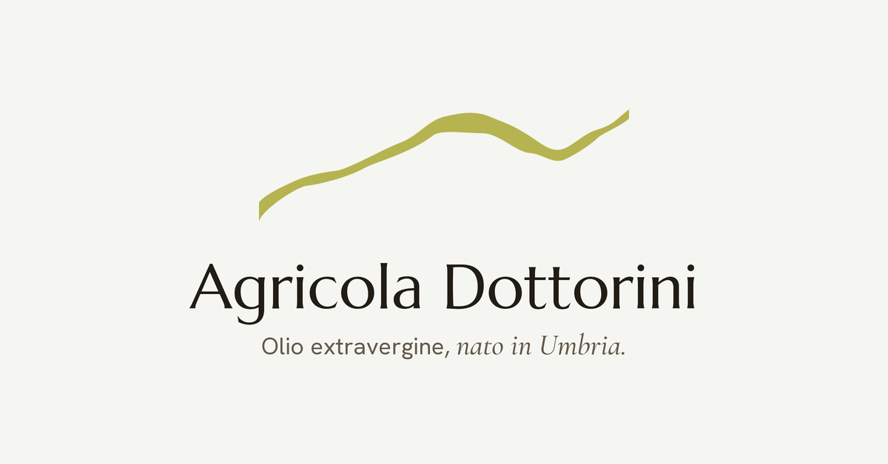

<p align="center">
  
</p>

# Agricola Dottorini, Shopify theme

The storefront theme for Azienda Agricola Dottorini: olive oil from Umbria, sold
direct to consumers. It started from the [Shopify Skeleton theme](https://github.com/Shopify/skeleton-theme)
and has been rebuilt around one idea: minimal, light and airy, with big images,
very little copy and restrained motion.

The storefront is in Italian. Design decisions, tokens and known gotchas live in
[DESIGN.md](./DESIGN.md). Instructions for coding agents live in [AGENTS.md](./AGENTS.md).

## Getting started

### Prerequisites

- [Shopify CLI](https://shopify.dev/docs/api/shopify-cli)
- Optional: the [Shopify Liquid VS Code extension](https://shopify.dev/docs/storefronts/themes/tools/shopify-liquid-vscode)

### Local development

```bash
shopify theme dev --store=fijxgy-0c.myshopify.com
```

This serves the theme at http://127.0.0.1:9292 and hot-reloads on save. Add
`--theme-editor-sync` while the store owner is editing in the theme editor, so
their changes are written back to the local JSON files instead of being
overwritten on the next push.

### Lint

Run before handing work over:

```bash
shopify theme check
```

## What's in the theme

### Homepage

| Section                       | What it is                                                                               |
| ----------------------------- | ---------------------------------------------------------------------------------------- |
| `dottorini-hero`              | Full-bleed framed photo, copy over a scrim, and the hill line drawing itself once        |
| `dottorini-featured-products` | Asymmetric grid: one large product card, two stacked beside it                           |
| `dottorini-manifesto`         | Editorial statement, company text, fact tiles and an offset portrait on a warm sand band |
| `dottorini-journey`           | "Dottorini varietà": the three olives in the blend (Moraiolo, Frantoiano, Leccino)       |
| `dottorini-convivia`          | Convivia, the family's home restaurant, as one large dark card with booking link         |

### Other pages

| File                              | What it is                                                                                       |
| --------------------------------- | ------------------------------------------------------------------------------------------------ |
| `sections/collection.liquid`      | Catalogo, a paginated product grid                                                               |
| `sections/product.liquid`         | Product page with thumbnail rail, sticky details and quantity stepper                            |
| `sections/dottorini-museo.liquid` | Museo della Civiltà Contadina, a masonry photo archive with a `<dialog>` viewer (`/pages/museo`) |
| `sections/cart-drawer.liquid`     | Floating cart panel, refreshed through the Section Rendering API                                 |
| `sections/cart.liquid`            | `/cart` page, the no-JavaScript fallback                                                         |

### Shared pieces

- `snippets/product-card.liquid` and `snippets/quick-add.liquid`: one product card in three shapes (featured, split, stacked) with a quick add button
- `snippets/brand-line.liquid`: the hill line, the company mark, used in the header and footer
- `snippets/css-variables.liquid` and `assets/critical.css`: color tokens, reset, buttons, spacing and the scroll reveal

## Visual language

| Token        | Value     | Use                            |
| ------------ | --------- | ------------------------------ |
| Background   | `#F5F6F2` | Cool off-white page            |
| Foreground   | `#1E221D` | Text, primary buttons          |
| Accent       | `#56622F` | Deep olive, the one accent     |
| Accent light | `#CBD6AC` | Light sage hover fill          |
| Tint         | `#EDE4D1` | Warm sand, story sections only |

Type is Hanken Grotesk for text and UI, Marcellus for headings and Cormorant Garamond italic for emphasis, all self-hosted in `assets/`. Buttons and inputs are full pills,
media and cards use a 14px radius, nothing else is rounded. Motion collapses to
static under `prefers-reduced-motion`. Full details in [DESIGN.md](./DESIGN.md).

## Brand assets

Sources and exports of the mark live in [`brand/`](./brand), which is excluded
from theme uploads by `.shopifyignore`.

| File                                                    | Use                                      |
| ------------------------------------------------------- | ---------------------------------------- |
| `dottorini-linea.svg` / `-chiara.svg`                   | The hill line, olive and light versions  |
| `dottorini-icona.svg`, `dottorini-icona-512.png`        | Square icon, cream line on an olive tile |
| `dottorini-social-1200x628.png` / `.jpg`                | Social share image (the one above)       |
| `favicon.ico`, `favicon-32.png`, `apple-touch-icon.png` | Favicon exports                          |

Re-export with `sips`, for example:

```bash
sips -s format png -Z 2000 brand/dottorini-linea.svg --out brand/dottorini-linea.png
```

## Theme architecture

```bash
.
├── assets          # critical.css, favicons and other static files
├── blocks          # Reusable, nestable theme blocks
├── brand           # Brand source files (not uploaded to Shopify)
├── config          # Global theme settings
├── layout          # theme.liquid and password.liquid
├── locales         # Translations (storefront is Italian)
├── sections        # Page sections, dottorini-* are the custom ones
├── snippets        # Shared Liquid fragments
└── templates       # JSON templates, incl. page.museo.json
```

Component CSS and JavaScript live in each file's `` and
`` tags. Only what every page needs goes in `assets/critical.css`.

## Editor content and git

Changes the owner makes in the theme editor are saved on Shopify
(`templates/*.json`, `sections/*-group.json`, `config/settings_data.json`), not
in git. Pull them before pushing, or push with those paths ignored, otherwise
they get overwritten.

## License

Built on the Shopify Skeleton theme, released under the [MIT](./LICENSE.md) License.
